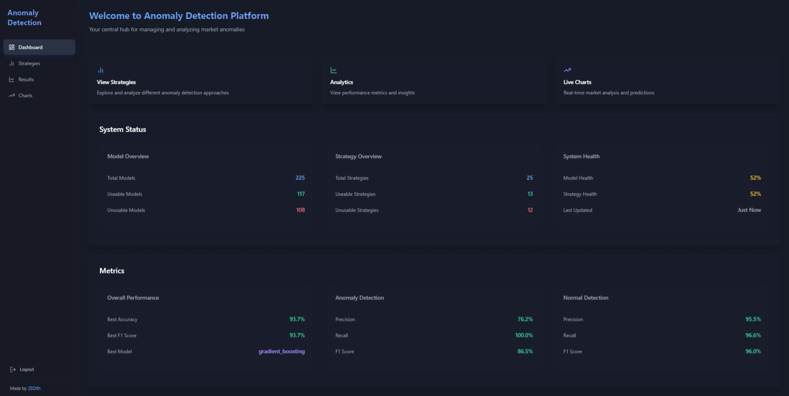

# Anomaly Detection Platform

<div align="center">
  
</div>

## Overview
The Market Anomaly Detection Platform is a web app designed to help users detect and analyze anomalies in time-series data. It's built with a user-friendly interface and powerful tools for data scientists and analysts. The platform currently includes 225 trained models, with 117 actively used in production. These models are built using 9 different ML algorithms across 25 detection strategies to provide reliable anomaly detection for various data patterns.

## Features
- **Advanced Detection Algorithms**:
  - Voting Ensemble (Meta-estimator)
  - Isolation Forest (Isolation-based)
  - XGBoost (Gradient Boosting)
  - Gradient Boosting (Classic)
  - Random Forest (Ensemble)
  - Neural Network (Deep Learning)
  - Support Vector Machine (Kernel-based)
  - Gaussian Mixture (Density-based)
  - Elliptic Envelope (Statistical)

- **Real-time Market Analysis**:
  - Live stock price monitoring
  - Bond market analysis
  - Forex market tracking
  - Real-time anomaly detection

- **AI Robo Advisor Integration**:
  - Advises on trading signals
  - Risk assessment
  - Portfolio optimization
  - Market sentiment analysis
  - Custom strategy implementation

- **Real-time Visualization**:
  - Interactive time-series charts
  - Performance metric dashboards
  - Strategy comparison tools
  - Anomaly highlighting
  - Confidence scoring visualization

- **Financial News Integration**:
  - Real-time news feed per ticker
  - Sentiment analysis on news (Robo Advisor)
  - Impact assessment
  - Historical news correlation
  - Custom news filtering

- **Strategy Management**:
  - 25 unique detection strategies
  - Feature engineering pipelines
  - Model performance tracking
  - Strategy comparison tools
  - Model Ticker Analysis

- **Performance Analytics**:
  - Real-time model evaluation
  - Precision-Recall metrics
  - F1 Score tracking
  - ROC curve analysis
  - Confusion matrix visualization
  - Detailed model insights

## Installation

### Prerequisites
- Python 3.12+
- Node.js 22+
- npm or yarn

### Model Training Environment Setup
1. Create a Python virtual environment in the `anomaly_models` directory:
```bash
cd anomaly_models
python -m venv .venv
```

2. Activate the virtual environment:
- Windows:
```bash
.venv\Scripts\activate
```
- Unix/MacOS:
```bash
source .venv/bin/activate
```

3. Install Python dependencies:
```bash
pip install -r requirements.txt
```

4. Create a `.env` file in the `anomaly_models` directory with your API keys:
```env
OPENAI_API_KEY=your_openai_key
DEFAULT_MODEL=your_model_name
```

### Frontend + Backend Setup
1. Install Node.js dependencies:
```bash
npm install
```

2. Configure the environment:
Modify the `.env` file in the root directory to set your desired ports:
```env
BACKEND_PORT=3000
FRONTEND_PORT=5174
```

The Vite proxy will automatically use these port configurations.

## Running the Application

### Development Mode
Run frontend and backend separately:
```bash
# Frontend
npm run dev:frontend

# Backend
npm run dev:backend
```

Or run both concurrently:
```bash
npm run dev
```

## Model Performance Metrics

### Anomaly Detection
- Precision: Accuracy of positive predictions
- Recall: Ability to find all anomalies
- F1 Score: Harmonic mean of precision and recall
- ROC-AUC: Overall detection capability

### Normal Detection
- True Negative Rate
- Specificity
- Normal State Accuracy
- Baseline Performance
